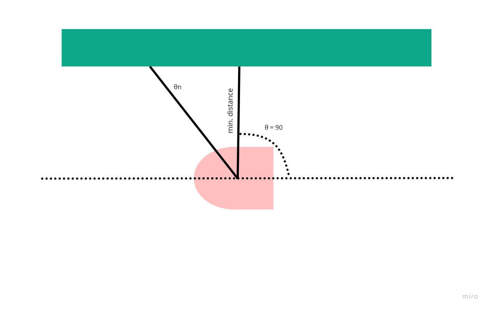
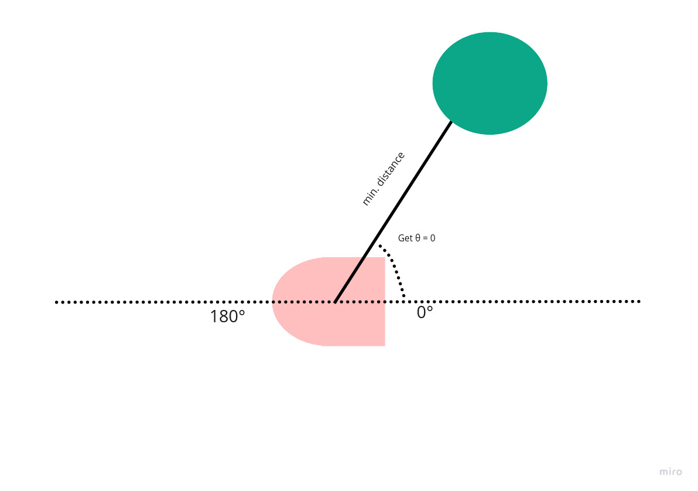
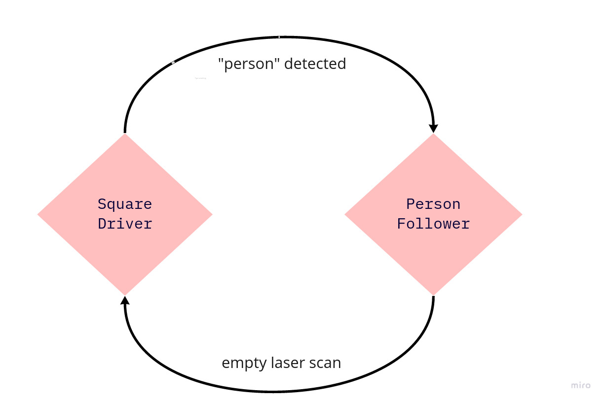

# Warmup Project
## Luke Nonas-Hunter | Sam Kaplan
### Computational Robotics Fall 2020

This is the first project of Introduction to Computational Robotics at Olin College of Engineering. 

In order to get familiar with ROS, the rospy library, object oriented code structure, LIDAR perception, reactive control, and proportional control we completed six robot behavior routines on a simulated Neato robot: 

* [Teleoperation](#teleoperation)
* [Driving a Square](#driving-in-a-Square)
* [Wall Follower](#following-a-Wall)
* [Person Follower](#Follow-a-Person)
* [Obstacle Avoidance](#Avoid-Obstacles)
* [Finite-State Controler](#finite-state-controller-implementation)

As whole, we used an object oriented code structure for our routines. This enables better organization and code reuse, which became especially important for the more complicated behaviors that built off the previous ones. However, we did not implement a strict "air-lock" of information flow until our Person Follower behavior. Once established, the getter | setter code blocking made debugging much easier. 

> Note: this class was supposed to provide more concrete robot feedback with real, physical robots, but due the COVID-19 pandemic it was converted to use the Gazebo simulator, which, for the most part, was an accurate representation of the NEATO robot. 

## Teleoperation

For this task, we wrote a simple teleoperation node that allows the user to control the robot with keyboard input. As it stands now, the command structure is as follows: 

    
| key | lin_vel   | ang_vel   | action  |
|:---:|:---------:|:---------:|:-------:|
|  w  |    0.3    |    0      | forward |
|  a  |    0      |    0.3    | turn left|
|  s  |    -0.3   |    0      | turn right |
|  d  |    0      |    0.3    | backward  |
|  e  |   0       |    0      | stop  |
  
As you can see, this is a very bare bones implementation, much simpler than the provided [teleop_twist_keyboard](http://wiki.ros.org/teleop_twist_keyboard) . We mostly wanted to get this done with so we could focus on the more complicated behaviors later in the project. 

>Key Takeaway: Non-clunky robot control is hard. If we had more time, we would have implemented a combined linear-angular velocity feature. This would have allowed us to arc for a turn, instead of stop motion all together in order to turn to the desired angle. It is also good to know that an ESTOP function that takes a keyboard input can be implemented if desired (probably more import when testing on real robots), instead of simply cancelling the running node in terminal. This can cause all sorts of issues, most notably that the robot will keep acting on its last received cmd_vel. If we had time, we would have implemented this feature in our final Finite State Machine. 

## Driving in a Square

The two seemingly best ways to instruct our robot to drive in 1m x 1m square were as follows: command a specified velocity for a given time, then turn 90 degrees, or to check encoder data and turn using odometry. We chose to write this behavior using odometry because learning to read odometry data is infinitely more useful in the long run than what is essentially hardcoding straight-aways and turns using time.

The majority of time spent on this behavior trying to figure out how to interpret the data we were given by our odometry subscriber. Our lives were made significanly easier by the discovery of the [transformations.py](http://docs.ros.org/jade/api/tf/html/python/transformations.html) library, which allowed us to convert from the given quaternions to simple Euler angles, given a specifed axis order.

After that, it was simply a matter of converting the Euler angles into a convient span of angles. Unfortunely, we kept the default span, which ranged from -PI to PI, instead of shifting over to a 0-2PI span. This caused headaches later on and eventually lead us to hard code the movements into the robot which could have easily been avoided.

>Key Takeaway: While it may seem easier to hardcode actions into the NEATO it is always better to try and generalize the code. This makes the code much more robust and allows for code reuse if a similar action needs to be implemented in a different behavior. 

## Following a Wall

Wall following is a simple, but important reactive behavior to implement. Much of the later behaviors would be influenced by how we decided to tackle this problem. 

Out implementation takes the shortest distance of a given set of LaserScan data as the angle it wants to orient itself 90 degrees from. The robot will always want to turn the shortest distance, so the direction it travels parallel to the wall is dependent on its initial orientation. If it's right side is wall-facing, it will travel that way, and vice versa. 

>Key Takeaway: Incorporate all LaserScan data if possible! We initially only used two scans that formed a right triangle, which did not perform well when turning. 

## Follow a Person

Following a person is another fundamental behavior for any reactive contronl robot. And indeed, out of all the routines made for the project, it is the most human-like. For isn't it human nature to seek companionship? To find another being with which we can share our lives?

At a high-level, this behavior functions very similary to our wall follower. Instead of getting our Neato to orient itself 90 degrees relative to the object, this time we wanted to face it, approach it, and stop it at an arbitrary distance (we liked to call this user-specificied social anxiety). First, we identify the angle of the shortest distance received by the LIDAR scanner. Using that angle as our starting position, we sweep through the lidar data in both directions looking for the edges of the object. Once we've located both edges we are able to calculate the center of mass of the "person" the NEATO wants to follow. Now that the NEATO knows the center of mass of the object and roughly how far away it is, it tries to align itself with the center of mass and ensure it is a specified distance (1.5m) away from the object. These actions are acomplished using proportional control based on two error functions (linear error and angular error) which find the difference between the robots current position and its desired position. The values for our proportional controll were found experimentally however if we had more time we could like to explore we would have liked to explore using a PID loop to find the fastest way to approach the object. 

>Note: this behavior can only follow a person that exists in an otherwise featureless plane. The next step would be some sort of RANSAC algorithm to identify objects we want to follow (cylinders) and those we do not (walls)

>Key Takeaway: We spent awhile trying to turn our error parameters so that when it was within a certain *small* value, the robot would stop moving. This led to host of problems, most notably making debugging significantly harder, becasue for each bug-fix test, you must also test your error margins haven't changed. Instead, it is highly advised that roboti movement be mathematically linked to error, instead of just checking within a certain error bound. It was also very helpful to make a "loop around" function to transform our LIDAR data into a format was easier to manipulate the way we were thinking about the array algorithmically. 
 

## Avoid Obstacles

Avoiding obstacles is one of the most important behaviors for any robot wishing to operate inside an environment with objects. Assuming most robots don't operate in the middle of a flat, featureless plane, it is safe to say that obstacle detection is a priority of robot operation.

While most of our previous code was written in a single class, it proved easier to read and debug to have all of the "important" math inside a helper PotentialField class, which takes an array of LIDAR-detected points, turns them into sources or sinks, and outputs a single vector in the direction of intended travel. From there, it was simply a matter of finding the error between the current and desired orienation, and writing a proportional control algorithm to properly scale our velocities. 

>Key Takeaway: rotation matrices are difficult to implement. Our largest code structure of the project by far, is much harder to keep track of. By the time we got to debugging ROS instead of math, we couldn't remember what we had fixed before! Good documention of code, and especially the information pipeline would have saved many hours here. 

## Finite-State Controller Implementation

We chose to combine our Square Driver behavior and our Person Follower behavior to implement the Finite State Machine portion of this project. Since this was both our first exposure to FSM's in general, as well as the smach library, we thought we should implement behaviors where there was a clear distinction of sensor data that could transition between states.  In our case, that mean looking to see if anything had been detected by our LIDAR. If not, it would drive in a square, but if there are any non-infinity values detected by our scan Subscriber, we moved to Person Follower State. 

We wanted to use [smach](http://wiki.ros.org/smach) library, because, while seemingly more complicated than passing functions around a Class, it seemed easily scalable, industry standard, and can run multiple state machines in paralell, which is a must for robots for complicated than a single differential drive system. 

 

The only thing needed to be added was a helper function to tell when to switch states. Because one state operated without the need to track an object, and object tracking was inherent in the other behavior's function, it seemed like a good idea to have the state machine switch be whether or not the laser scan was receiving "real" data, i.e. real numbers. 